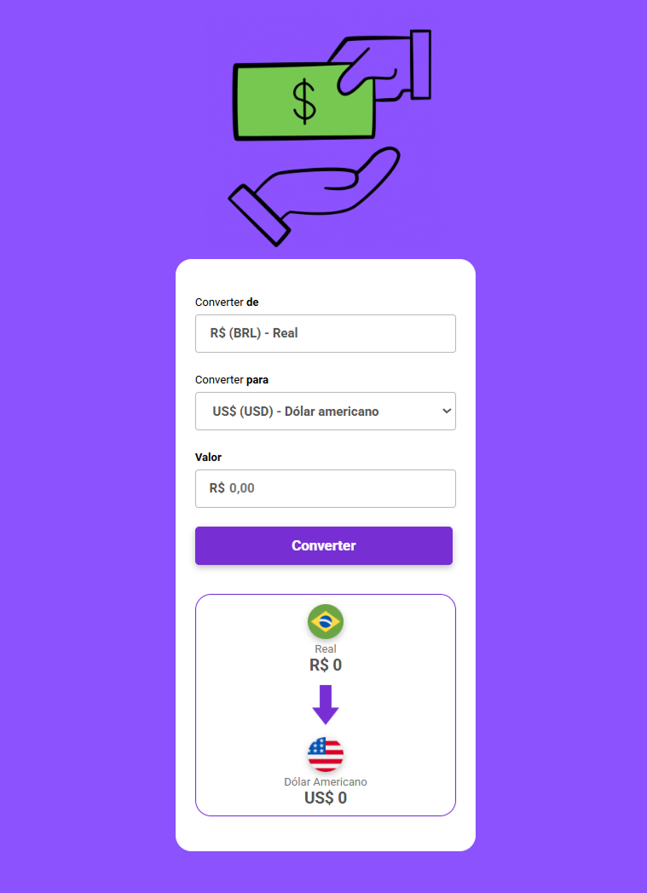

# 💱 Currency Converter | Conversor de Moedas


Aplicação web desenvolvida para converter valores em **Real (BRL)** para moedas internacionais.  
O projeto foi criado com o objetivo de praticar **lógica em JavaScript, manipulação do DOM e estruturação de aplicações front-end**.

---

## 🖥️ Preview



---

## 🌍 Deploy

🔗 **Aplicação online:**

<a href="https://aline-mmiranda.github.io/currency-converter/" target="_blank">Acessar projeto</a>

---

## 🎯 Objetivo do projeto

O objetivo foi desenvolver uma aplicação simples, porém funcional, para consolidar fundamentos importantes do desenvolvimento front-end, especialmente:

- Lógica de programação
- Manipulação de eventos
- Atualização dinâmica do DOM
- Organização de código JavaScript

Este projeto também faz parte da construção do meu portfólio profissional como desenvolvedora front-end.

---

## ⚙️ Funcionalidades

O sistema permite:

- Selecionar a moeda de destino
- Inserir um valor em Real (BRL)
- Converter automaticamente o valor
- Atualizar o resultado dinamicamente
- Exibir valores formatados corretamente

Moedas disponíveis:

- 🇺🇸 USD — Dólar americano
- 🇪🇺 EUR — Euro
- 🇬🇧 GBP — Libra esterlina
- ₿ BTC — Bitcoin

---

## 📐 Arquitetura da solução

A aplicação foi estruturada com separação básica de responsabilidades:

**HTML**
Responsável pela estrutura da interface.

**CSS**
Responsável pela estilização e layout.

**JavaScript**
Responsável pela lógica da aplicação:

- Captura dos eventos
- Processamento da conversão
- Manipulação do DOM
- Atualização dinâmica dos dados

Fluxo da aplicação:

Usuário seleciona moeda →  
Insere valor →  
Evento dispara →  
Valor convertido →  
Resultado exibido.

---

## 🔍 Decisões técnicas

Durante o desenvolvimento foram tomadas algumas decisões:

- Utilizar **JavaScript puro** para fortalecer os fundamentos antes de migrar para frameworks
- Utilizar taxas fixas inicialmente para focar na lógica da aplicação
- Manter estrutura simples e legível
- Atualizar a interface dinamicamente para simular comportamento real

---

## 🧩 Desafios encontrados

Alguns desafios durante o desenvolvimento:

- Garantir a conversão correta dos valores
- Formatar corretamente moedas diferentes
- Evitar duplicação de código
- Garantir atualização correta do resultado

---

## 💡 Soluções implementadas

Para resolver esses pontos:

- Criação de funções reutilizáveis
- Uso de condicionais bem definidas
- Conversão explícita de tipos numéricos
- Uso de `Intl.NumberFormat()` para formatação
- Separação entre lógica e interface

---

## 🧠 Conceitos técnicos aplicados

- Manipulação do DOM
- Eventos JavaScript
- Estrutura condicional
- Funções reutilizáveis
- Conversão de tipos
- Formatação de dados
- Organização de código

---

## 🏗️ Estrutura do projeto

```text
📦 currency-converter
 ┣ 📂 src
 ┃ ┗ ⚡ script.js → lógica da aplicação
 ┣ 📂 assets
 ┃ ┣ 🎨 style.css → estilos
 ┃ ┗ 📂 images → screenshots
 ┣ 🌐 index.html → interface
 ┗ 📄 README.md → documentação
 ```

---

## 🛠️ Tecnologias

- HTML5
- CSS3
- JavaScript (ES6+)
- Git
- GitHub
- GitHub Pages

---

## 📊 Competências demonstradas

Este projeto demonstra:

✔ Lógica de programação  
✔ Manipulação do DOM  
✔ Eventos JavaScript  
✔ Organização de código  
✔ Versionamento com Git  
✔ Deploy de aplicações  

---

## 🚀 Roadmap

Melhorias planejadas:

### v2
- Integração com API de câmbio em tempo real

### v3
- Conversão entre múltiplas moedas

### v4
- Responsividade completa

### v5
- Refatoração para React

---

## 📚 Aprendizados

Este projeto contribuiu para o desenvolvimento das seguintes habilidades:

- Pensamento lógico aplicado a aplicações web
- Estruturação de pequenos sistemas front-end
- Separação de responsabilidades no código
- Resolução de problemas técnicos
- Mentalidade de melhoria contínua

---

## 👩‍💻 Autora

**Aline M Miranda**  
Desenvolvedora Front-End em formação

[](https://github.com/aline-mmiranda)
[](https://www.linkedin.com/in/aline-mmiranda)

---

## 📌 Status do projeto

🚧 Projeto funcional com melhorias planejadas.

---

## ⭐ Observação

Este projeto faz parte da minha jornada de transição de carreira para tecnologia, com foco na construção de aplicações front-end e evolução contínua como desenvolvedora.
